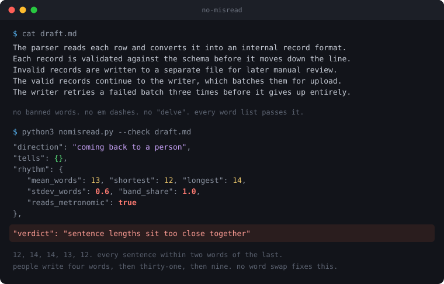

# no-misread



[English](README.md)

兩個人隔著鑰匙孔講話,而且誰都沒辦法回頭問對方剛才是什麼意思。

你寫一段 prompt,模型讀到的是你沒說過的意思。模型回你一段話,你掃過四段密密麻麻,漏掉唯一重要的那一句。**這兩件事是同一個失敗,只是方向相反** —— 而幾乎沒有人把它們當成同一個問題處理。

這是一個 skill 加一支 linter,兩個方向都管。**你不需要選模式**,文字自己會說它要去哪邊,工具讀得出來。

```console
$ python3 nomisread.py --check my-prompt.md
  "direction": "going out to a machine",
  "direction_why": "detected: 26 句裡有 12 句以祈使句開頭"

$ python3 nomisread.py --check the-answer.md
  "direction": "coming back to a person",
  "direction_why": "detected: 65 句裡只有 2 句在下指令"
```

**去程。** 指令、prompt、tool description、錯誤訊息 —— 任何模型或非母語者要剖析、而且沒有人可以問的文字。**敵人是歧義**,所以句子平整、扁、直白才是對的。

**回程。** 回答、草稿、README、要掛你名字發出去的貼文。**敵人是機器腔**,句子必須像人寫的那樣起伏。

## 只有三條規則會翻轉

| | 去程(給機器) | 回程(給人) |
|---|---|---|
| 句長 | 平整,25 字以內 | 起伏,否則讀起來就是機器寫的 |
| 縮寫 | 避免,模型會誤讀 `won't` | 保留,人本來就這樣講話 |
| `may` / `might` / `could` | 避免,讀者沒辦法問你是哪一個 | 保留,信心程度本身就是內容 |

其餘全部共用:隱形字元、主動語態、每個動詞都要有動作者、具體優於籠統、不要開場鋪陳、不要收尾儀式、不用磨損掉的字、不用「不是 X,是 Y」那種反轉句型。

所以這不是兩種哲學的折衷。**一段文字只有一個任務**,工具自己判斷是哪一個。判錯的時候用 `--type technical` 或 `--type prose` 覆寫,那是唯一需要動腦的時候。

## 用讀的找不到的兩件事

**隱形字元。** 零寬空格、word joiner、BOM、軟連字號、不斷行空格。**鍵盤打不出這些東西。** 它們會活過複製貼上,而且一路上會弄壞 `grep` 跟 `diff`。`--strip` 全部清掉。

**節奏。** 上面那張圖就是:一段沒有任何禁用字、沒有破折號、沒有 `delve` 的文字 —— 這個類別裡每一份字表都會放它過。

十二、十四、十四、十三、十二。**人不會這樣寫。** 人是四個字,然後三十一個字,然後九個字,因為一個念頭結束的時候它就結束了。

偵測研究把這個叫做 burstiness。已發表的比較顯示,GPT-4o 大約 85% 的句子落在 15 到 28 字這個帶狀區間裡,而人類寫作從四個字一路散到五十幾個字,沒有中心。兩個指標都低的文字,偵測器有九成以上會標記;只把 burstiness 拉高,就掉到四成左右。

`--check` 同時回報兩個數字:`stdev_words` 是離散程度,一個特別長的句子就能把它灌高;`band_share` 是落在平均值正負 25% 之內的句子比例,那才是研究真正描述的「擠在中間」。**兩個都不合格才會被判定為機械節奏**,所以刻意寫得很短的段落不會被誤判。

## 它會校準到你身上

通用門檻是對「一般寫作者」的猜測,而你不是一般寫作者。

```bash
python3 "$SKILL/lint/nomisread.py" --learn 舊文章.md 筆記.md 信件.md
```

餵它**你自己寫的、沒有用模型的**文字。它會量出你真實的句長分佈,記下哪些「磨損字」其實是你本來就在用的,之後就拿**你的基準**去檢查後面每一份草稿。

那份磨損字清單從來就不是「這些字是錯的」。**你在自己四千字的文章裡用了六次 `leverage`,那它就是你的字。** 證據是你自己文章裡的出現頻率,所以這份清單長不出「你某次隨口說的偏好」。

它拒絕從模型產出學習,包括它自己改寫過的東西。那個迴圈會讓 profile 慢慢學成模型的習慣,卻還宣稱那是在描述你。

profile 預設落在 `~/.no-misread/voice.json`,跟著人走。團隊想要統一語氣就在 repo 放 `./profile/voice.json`,那個優先。`$NOMISREAD_PROFILE` 兩個都蓋過。

## 安裝

```bash
npx skills add ryvn-dev/no-misread --skill no-misread --agent claude-code
```

或直接 clone:

```bash
git clone https://github.com/ryvn-dev/no-misread ~/.claude/skills/no-misread
```

**Plugin** —— 把這個 repo 加成 marketplace,然後安裝 `no-misread`。
**Projects / 自訂指令** —— 貼上 `prompts/system-prompt.md`,大約 250 字。
**Output style** —— 複製 `output-styles/no-misread.md`。
**只要 linter** —— `lint/nomisread.py` 單檔、純標準庫、零安裝。

## 使用

```bash
SKILL=~/.claude/skills/no-misread     # 你裝在哪就寫哪

python3 "$SKILL/lint/nomisread.py" --strip draft.md > clean.md
python3 "$SKILL/lint/nomisread.py" --check clean.md   # 方向自動判斷
python3 "$SKILL/lint/nomisread.py" --self-test
```

直接 `python3 lint/nomisread.py` 只在 clone 出來的目錄裡有效。裝成 skill 之後,路徑要從安裝位置組出來。

或者直接開口:「幫我把這段改得像人寫的」、「把這個 prompt 改成模型不會誤讀」、「清掉浮水印」。

`--check` 有問題就 exit 1,可以直接當 CI 關卡。**這個 repo 每次 push 都會把自己的文件丟進自己的 linter,不過就不給過。**

## 這裡明講一個可以作弊的方法

只要把一個數字設成關卡,大家就會照著那個數字寫。你可以每段塞一句三個字的短句去過節奏檢查:離散度上去、`band_share` 下來、判定變綠,**而文章比你動手前更難看**。

這件事沒有任何機制擋得住,而一份不肯承認這點的 README 是不誠實的。這個量測描述的是機器文字的**症狀**,它不是好文章的定義;把它當成目標而不是訊號,只會長出另一種怪癖。

這個檢查存在的意義,是讓你注意到「每一句都一樣長」。**至於要怎麼處理,那是寫作判斷,那是你的事。**

## 它不做的事

它不會讓空洞的內容變成真的。沒東西講的段落改完只會變乾淨,然後還是空的。

它不對抗偵測器,也不打算。它清掉的是「生成」留下的痕跡,好讓值得讀的文字用它自己的條件被讀。**該揭露你用了 AI 的場合,就去揭露。**

它不解析文法。這支 linter 是正規表達式加上你自己讀。零分代表「這支工具知道的東西都乾淨」,不代表這是人寫的。

不要對原始碼跑 `--strip`。把字串裡的彎引號換成直引號會改變那個字串。

## 授權與標註

MIT。隨便用、隨便 fork、拿去賣都可以。

如果你要發佈這個 skill 或它的衍生版本,請保留著作權聲明並標註 `ryvn-dev/no-misread`。就這一個要求,而且 MIT 本來就要求。

**如果它在你的文章裡抓到了什麼值得抓的東西,給個星。** 下一個人是這樣找到它的。

## 授權條款

[MIT](LICENSE) © 2026 ryvn-dev
